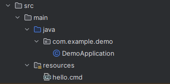

# Resource Fetcher
The project encapsulates the process of unpacking resource
files to system's temporary folder.
### Why?
Java already has an API to fetch resource file as InputStream using `Class#getResourceAsStream(String name)`
method, but this is only useful when the program needs to explicitly read
content of the file as bytes. For situations when the file should be used by system itself,
or by some CLI using java Process api, there is no way to access resource using file system, 
because it is packed inside JAR archive.
### So what do we do?
This library helps unpack resource files from JAR to system's temp folder.
The library creates project subfolder in Temp and copies resource with requested name there. 
It also allows to clean up the folder when the resources are no longer needed.
## Usage
Let's say we have a cmd script in our project, and we want program
to execute it in runtime.

Hello.cmd:

```cmd 
echo Hello World
```
But since file is stored as inner resource inside of application, 
we won't be able to get filepath to its location inside a JAR using java resource API.



#### Solution
We can use `TempFolder` class to create project's temporary folder in system's
default temp directory, and fetch the scripts file from JAR there. Then, we can use methods
of `Resource` class to get full path to the file which we can use to execute script:

```java
public class DemoApplication {
    public static void main(String[] args) throws Exception {
        TempFolder tempFolder = new TempFolder(".striker", "demo");
        Resource script = tempFolder.fetchResource("hello.cmd");

        byte[] output = new ProcessBuilder("cmd", "/c", script.getPath())
                .start()
                .getInputStream()
                .readAllBytes();
        System.out.println(new String(output));

        tempFolder.delete();
    }
}
```
or for auto-deleting:
```java
public class DemoApplication {
    public static void main(String[] args) throws Exception {
        try (TempFolder tempFolder = new TempFolder(".striker", "demo")) {
            Resource script = tempFolder.fetchResource("hello.cmd");

            byte[] output = new ProcessBuilder("cmd", "/c", script.getPath())
                    .start()
                    .getInputStream()
                    .readAllBytes();
            System.out.println(new String(output));
        }
    }
}
```
